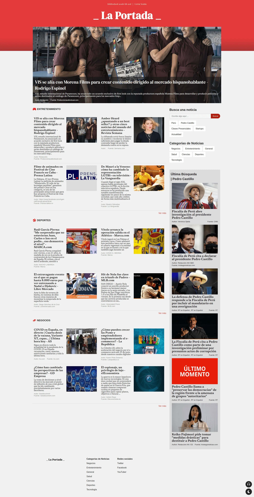
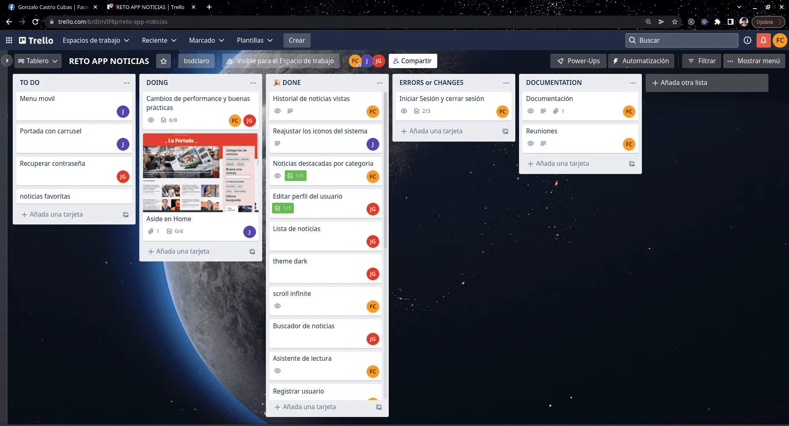

# RETO APP NOTICIAS

El proyecto es un [reto técnico](https://github.com/cocotopia/reto-app-noticias) dentro de la escuelita de
[RPA Latam](https://rpalatam.com.pe/).

## ⭐ Acerca del proyecto

La Portada es una web de noticias recientes y en español. Todo el acontecer del mundo en un solo lugar.



### 📝 Requerimientos

1. Página Inicio con la portada del día y noticias por categoría.
2. Página de Noticias por categoría con Scroll infinito.
3. Buscador de noticias.
4. Última búsqueda del usuario.
5. Asistente de lectura.
6. Modo oscuro inteligente.
7. Historial de noticias del usuario.
8. Registrar usuario.
9. Iniciar sesión.
10. Mostrar perfil de usuario.
11. Verificar correo.
12. Cambiar de contraseña.
13. Editar perfil del usuario.
14. Demo de suscripción
15. PWA

## 📦 Estructura de carpetas

```
├── public
│   └── assets
│       ├── fonts
│       └── images
└── src
    ├── components
    ├── hooks
    ├── pages
    ├── routes
    ├── services
    └── state
        └── context

```

## 👥 El equipo

- [Felix Castro](https://www.linkedin.com/in/felix-castro-cubas-633037192)
- [Joel Garay](https://www.linkedin.com/in/joel-isaac-garay-chuquispuma-566215220)
- [Jose Vera](https://www.linkedin.com/in/jose-miguel-vera-mamani-b03b49207)

## 🛠️ Técnologias y recursos

- [Reactjs](https://es.reactjs.org/)
- [React Router](https://reactrouter.com/)
- [React Hook Form](https://react-hook-form.com/)
- React Hooks
- React Context
- [React Helmet Async](https://www.npmjs.com/package/react-helmet-async)
- CSS module, Flexbox, CSS Grid
- Mobile-first workflow
- [News API](https://newsapi.org/)
- ARC Identity API
- [Cloud Firestore](https://firebase.google.com/docs/firestore)
- [React Icons](https://react-icons.github.io/react-icons/)
- [Pure CSS Loaders](https://loading.io/css/)

## 💯 Trabajo en equipo

- Organización del equipo y tareas con tablero Kanban en Trello.
- Creación del repo del proyecto con ramas main y dev en GitHub.
- Revisión y feedback de cada avance.
- Repartir nuevas tareas en cada reunión.



## Available Scripts

In the project directory, you can run:

### `npm start`

Runs the app in the development mode.\
Open [http://localhost:3000](http://localhost:3000) to view it in your browser.

The page will reload when you make changes.\
You may also see any lint errors in the console.

### `npm test`

Launches the test runner in the interactive watch mode.\
See the section about [running tests](https://facebook.github.io/create-react-app/docs/running-tests) for more information.

### `npm run build`

Builds the app for production to the `build` folder.\
It correctly bundles React in production mode and optimizes the build for the best performance.

The build is minified and the filenames include the hashes.\
Your app is ready to be deployed!

See the section about [deployment](https://facebook.github.io/create-react-app/docs/deployment) for more information.

### `npm run eject`

**Note: this is a one-way operation. Once you `eject`, you can't go back!**

If you aren't satisfied with the build tool and configuration choices, you can `eject` at any time. This command will remove the single build dependency from your project.

Instead, it will copy all the configuration files and the transitive dependencies (webpack, Babel, ESLint, etc) right into your project so you have full control over them. All of the commands except `eject` will still work, but they will point to the copied scripts so you can tweak them. At this point you're on your own.

You don't have to ever use `eject`. The curated feature set is suitable for small and middle deployments, and you shouldn't feel obligated to use this feature. However we understand that this tool wouldn't be useful if you couldn't customize it when you are ready for it.
